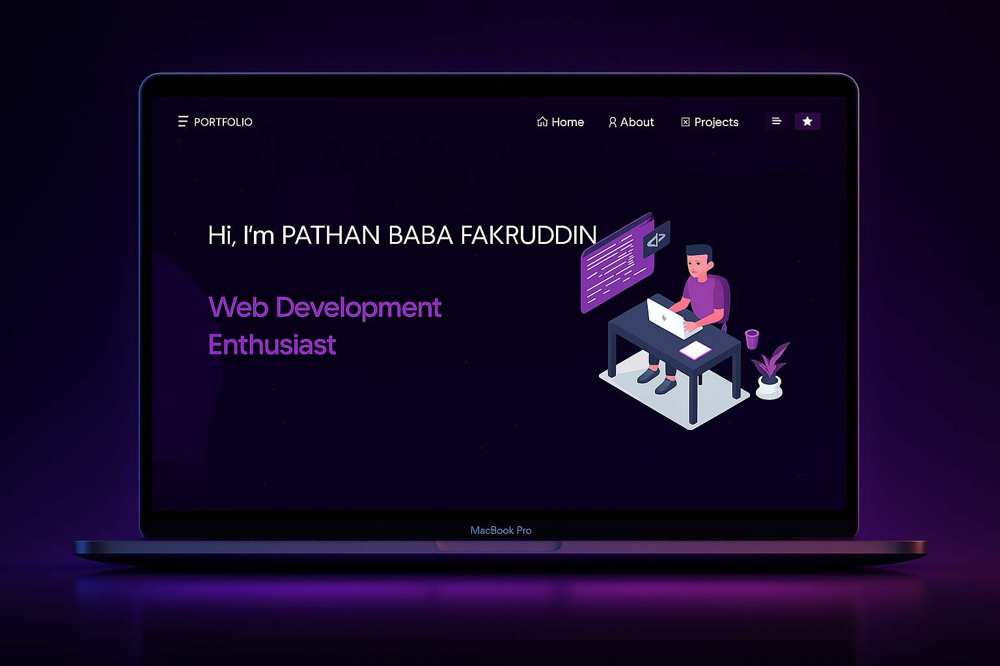

<h2 align="center">
  Portfolio Website - v1.0<br/>
  <a href="https://your-vercel-link.vercel.app" target="_blank">pathan.vercel.app</a>
</h2>

<div align="center">
  
</div>

<br/>

<div align="center">


</div>

<h3 align="center">
  🔹 <a href="https://github.com/pathan123321/My-Portfolio/issues">Report Bug</a> &nbsp; &nbsp;
  🔹 <a href="https://github.com/pathan123321/My-Portfolio/issues">Request Feature</a>
</h3>

---

## 🚀 About the Project

This is my personal portfolio website showcasing my skills, projects, resume, and experience as a developer.  
The website is fully responsive and built using modern web technologies.

---

## 🛠 Built With

- React.js  
- JavaScript  
- Node.js  
- CSS3  
- VS Code  
- Vercel (Deployment)

---

## ✨ Features

✔ Multi-Page Layout  
✔ Smooth Animations  
✔ Modern Particle Background  
✔ Clean UI with React-Bootstrap  
✔ Fully Responsive on all devices  
✔ Live Projects Showcase  
✔ Resume Preview + Download  

---

## 📂 Getting Started

### Prerequisites  
You must have **Node.js** and **Git** installed.

### Installation

```bash
git clone https://github.com/pathan12321/Portfolio
cd Portfolio
npm install
npm start
